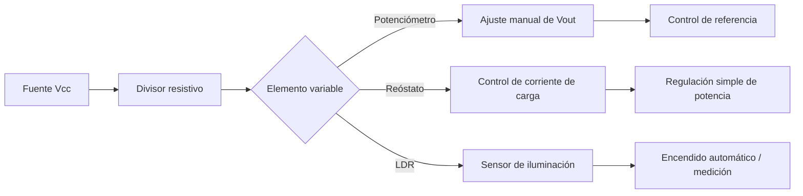

# Título de la Sesión: Resistencias fijas y variables. Reóstato, potenciómetro y trimmer. Fotoresistencia. Aplicaciones prácticas

## Introducción
Las resistencias son los elementos pasivos más utilizados para limitar corriente, polarizar dispositivos, dividir tensión, sensar magnitudes físicas y disipar potencia. En ingeniería eléctrica y electrónica, la correcta selección de una resistencia fija o variable determina la estabilidad térmica, la precisión del circuito y su confiabilidad operativa. La sesión conecta el modelo eléctrico ideal con el comportamiento real de resistencias comerciales, reóstatos, potenciómetros, trimmers y fotoresistencias (LDR), enfatizando aplicaciones de instrumentación, control y acondicionamiento de señales.

## Objetivo de Aprendizaje
Analizar, calcular y seleccionar resistencias fijas y variables para circuitos de corriente continua, e interpretar la respuesta de una fotoresistencia en aplicaciones de sensado y control básico.

## Desarrollo del Tema (Explicación de la tecnología)
La resistencia eléctrica cuantifica la oposición al paso de la corriente. Para un conductor homogéneo de longitud $\ell$, área transversal $A$ y resistividad $\rho$, se modela por:

$$
R = \rho\frac{\ell}{A}
$$

En el régimen lineal ideal, la relación tensión-corriente está dada por la ley de Ohm:

$$
V = IR
$$

La potencia disipada por efecto Joule puede expresarse como:

$$
P = VI = I^2R = \frac{V^2}{R}
$$

Por ello, la selección de una resistencia no depende solo del valor óhmico, sino también de su potencia nominal, tolerancia, coeficiente térmico y tecnología de fabricación (carbón, película metálica, bobinada, SMD, entre otras).

### Resistencias fijas
Se emplean cuando el valor de diseño no debe modificarse. En divisores de tensión, dos resistencias en serie permiten obtener una fracción de la tensión de entrada:

$$
V_o = V_{in}\frac{R_2}{R_1+R_2}
$$

Este principio aparece en redes de polarización, escalamiento de sensores y acondicionamiento de referencias analógicas.

### Reóstato
El reóstato es una resistencia variable usada típicamente con dos terminales para modificar la corriente de una carga. Si se conecta en serie con una carga $R_L$ alimentada por una fuente $V_s$:

$$
I = \frac{V_s}{R_{rh}+R_L}
$$

Al aumentar $R_{rh}$, la corriente disminuye. Este dispositivo se usa en control simple de potencia, bancos de carga y ajuste manual de corriente.

### Potenciómetro
El potenciómetro posee tres terminales y funciona como divisor de tensión ajustable. Si el cursor divide la resistencia total $R_T$ en dos secciones, una fracción $\alpha R_T$ y la otra $(1-\alpha)R_T$ con $0\leq\alpha\leq1$, entonces:

$$
V_o = \alpha V_{in}
$$

para el caso ideal sin carga. Si existe una carga conectada a la salida, debe analizarse el efecto de carga mediante equivalente de Thévenin, pues la relación deja de ser estrictamente lineal.

### Trimmer
El trimmer o preset es un potenciómetro de ajuste fino diseñado para calibración esporádica. Se utiliza en compensación de offset, ajuste de ganancia, sintonía y calibración de umbrales. Su principal diferencia con el potenciómetro de panel es el ciclo de uso reducido y su integración sobre PCB.

### Fotoresistencia (LDR)
La fotoresistencia reduce su resistencia al aumentar la iluminancia incidente. Un modelo empírico útil es:

$$
R_{LDR} = K E^{-\gamma}
$$

siendo $E$ la iluminancia en lux, $K$ una constante tecnológica y $\gamma$ un exponente que depende del material fotosensible. El LDR se utiliza normalmente en un divisor de tensión para convertir luz en voltaje medible:

$$
V_o = V_{cc}\frac{R_{fix}}{R_{fix}+R_{LDR}}
$$

si el LDR está en la rama superior del divisor. La relación entrada-salida es no lineal, por lo que la sensibilidad depende del punto de operación.

### Consideraciones prácticas de selección
- **Tolerancia:** afecta el error de diseño; valores típicos de $\pm 1\%$, $\pm 5\%$ o $\pm 10\%$.
- **Potencia nominal:** debe cumplirse $P_{op}<P_{nom}$ con margen térmico.
- **Ruido y estabilidad:** importantes en instrumentación.
- **Ley del potenciómetro:** lineal o logarítmica según la aplicación.
- **Respuesta espectral del LDR:** condiciona su uso en fotometría o automatización.

## Preguntas Orientadoras
1. ¿En qué condiciones un potenciómetro deja de comportarse como divisor lineal de tensión y cómo se cuantifica ese error?
2. ¿Por qué una resistencia de igual valor óhmico, pero menor potencia nominal, puede fallar aun cuando el circuito cumple la ley de Ohm?
3. ¿Qué ventajas y limitaciones presenta una fotoresistencia frente a un fotodiodo para detección de luz ambiental?
4. ¿Cómo influye la tolerancia de las resistencias en la precisión de un divisor de tensión para instrumentación?
5. ¿Qué criterios justifican escoger un reóstato bobinado en lugar de una resistencia fija más un transistor de control?

## Ejercicios Propuestos
1. Una resistencia de película metálica de $2.2\,\text{k}\Omega$ se conecta a $12\,\text{V}$. Calcule la corriente, la potencia disipada y determine si una resistencia de $0.125\,\text{W}$ es suficiente.
2. Diseñe un divisor resistivo a partir de $15\,\text{V}$ para obtener aproximadamente $5\,\text{V}$ sobre una carga de alta impedancia, usando valores comerciales de la serie E12. Estime el error porcentual.
3. Un reóstato de $0$ a $100\,\Omega$ se coloca en serie con una lámpara equivalente a $24\,\Omega$ y una fuente de $12\,\text{V}$. Calcule el rango de corrientes posible y la potencia máxima que debe soportar el reóstato.
4. Un potenciómetro lineal de $10\,\text{k}\Omega$ alimentado con $9\,\text{V}$ se fija en $\alpha=0.35$. Determine el voltaje de salida sin carga y con una carga de $5\,\text{k}\Omega$ conectada entre salida y tierra.
5. En un divisor con $V_{cc}=5\,\text{V}$, $R_{fix}=4.7\,\text{k}\Omega$ y un LDR que varía entre $1\,\text{k}\Omega$ y $50\,\text{k}\Omega$, calcule el rango de $V_o$ y explique en qué condición la sensibilidad $\mathrm{d}V_o/\mathrm{d}R_{LDR}$ es mayor.

## Actividad en Clase (Hands-on)
**Práctica guiada: caracterización de un divisor resistivo con LDR y calibración con potenciómetro**

1. Identificar con multímetro resistencias fijas de distinto valor y verificar tolerancia mediante el código de colores.
2. Medir la resistencia de un potenciómetro y localizar sus terminales extremos y cursor.
3. Conectar un divisor resistivo con un potenciómetro como referencia variable y observar la variación de $V_o$.
4. Sustituir una rama del divisor por un LDR y medir $V_o$ bajo distintas condiciones de iluminación.
5. Construir una tabla de datos $E$ versus $R_{LDR}$ versus $V_o$.
6. Ajustar un umbral con trimmer para activar una salida lógica o un LED cuando la iluminación descienda por debajo de una condición dada.
7. Discutir fuentes de error: iluminación ambiente, contacto del cursor, tolerancia y calentamiento.

## Recursos Adicionales
- Alexander, C. K., & Sadiku, M. N. O. *Fundamentals of Electric Circuits*. McGraw-Hill.
- Horowitz, P., & Hill, W. *The Art of Electronics*. Cambridge University Press.
- Bourns. *Trimpot Trimming Potentiometers* y documentación técnica de potenciómetros: https://www.bourns.com/products/trimpot-trimming-potentiometers
- Vishay. Catálogos y notas técnicas de resistores y sensores fotoresistivos: https://www.vishay.com/
- Hoja de datos sugerida para consulta crítica: potenciómetro/trimmer Bourns 3296, fotoresistencia GL5528 o equivalente, resistencias de película metálica de $1/4\,\text{W}$.
