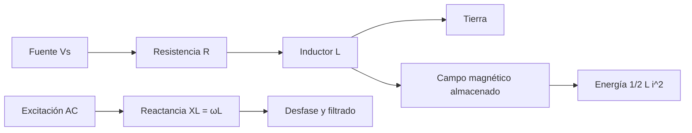

# Título de la Sesión: Campo magnético. Inductancia o autoinductancia eléctrica. Bobina. Funcionamiento de una bobina en AC y CD. Prueba de bobinas con el multímetro. Circuitos serie y paralelo. Aplicaciones prácticas

## Introducción
La bobina es el elemento pasivo asociado al almacenamiento de energía en el campo magnético. Su estudio es esencial para comprender motores, transformadores, filtros, relevadores, fuentes conmutadas y sistemas de conversión de energía. La inductancia introduce dinámica de corriente, oposición a variaciones bruscas y fenómenos de desfase que permiten controlar energía, filtrar perturbaciones y acoplar sistemas eléctricos.

## Objetivo de Aprendizaje
Analizar, modelar y comprobar experimentalmente el comportamiento de bobinas e inductores en DC y AC, incluyendo sus asociaciones serie-paralelo y criterios básicos de prueba con multímetro.

## Desarrollo del Tema (Explicación de la tecnología)
La inductancia expresa la capacidad de un elemento para oponerse a variaciones de corriente mediante una fem inducida. Para un inductor ideal:

$$
v_L(t) = L\frac{di(t)}{dt}
$$

De manera equivalente,

$$
i(t) = \frac{1}{L}\int v_L(t)\,dt + i(0)
$$

La energía almacenada en el campo magnético es:

$$
W_L = \frac{1}{2}Li^2
$$

### Fundamento físico
Una corriente que circula por una bobina genera un flujo magnético. Cuando la corriente cambia, también cambia el flujo, induciendo una tensión que se opone a esa variación, conforme a la ley de Lenz. En una geometría simple de $N$ espiras, la inductancia depende del material magnético, la longitud del circuito magnético y el número de espiras; idealmente se observa una fuerte dependencia con $N^2$.

### Funcionamiento en DC
En un circuito RL excitado por una fuente DC, la corriente crece según:

$$
i(t) = \frac{V_s}{R}\left(1-e^{-t/\tau}\right)
$$

con constante de tiempo:

$$
\tau = \frac{L}{R}
$$

En el instante inicial el inductor se opone al cambio de corriente, y en estado estacionario ideal se comporta como un cortocircuito. Sin embargo, en un inductor real siempre existe una resistencia serie del devanado.

### Funcionamiento en AC
La impedancia del inductor en régimen senoidal es:

$$
Z_L = j\omega L
$$

con reactancia inductiva:

$$
X_L = \omega L
$$

La tensión adelanta a la corriente en $90^\circ$. A mayor frecuencia, mayor oposición al paso de la corriente alterna. Esta propiedad se aprovecha en filtros, balastos, supresión de ruido y adaptación de potencia.

### Asociación serie y paralelo
Para inductores no acoplados magnéticamente:

- En serie:

$$
L_{eq} = \sum_{k=1}^{n} L_k
$$

- En paralelo:

$$
\frac{1}{L_{eq}} = \sum_{k=1}^{n}\frac{1}{L_k}
$$

Si existe acoplamiento magnético, la inductancia equivalente se modifica por la inductancia mutua $M$, por lo que esta formulación simple deja de ser suficiente.

### Prueba de bobinas con multímetro
El multímetro permite verificar continuidad del devanado y estimar la resistencia óhmica. Una bobina abierta presenta resistencia infinita; una bobina en cortocircuito parcial puede mostrar continuidad, pero falla en su valor inductivo o en su factor $Q$. Por ello, la continuidad es condición necesaria pero no suficiente para declarar una bobina en buen estado.

### Aplicaciones prácticas
- filtros RL y RLC,
- relevadores y actuadores electromagnéticos,
- almacenadores de energía en convertidores DC-DC,
- supresión de EMI,
- arranque y control de máquinas eléctricas.

## Preguntas Orientadoras
1. ¿Por qué una bobina ideal se comporta como cortocircuito en régimen DC permanente, pero se opone a cambios rápidos de corriente?
2. ¿Qué errores de diseño aparecen al ignorar la resistencia serie del devanado o la saturación del núcleo?
3. ¿En qué condiciones deja de ser válida la fórmula de inductancias equivalentes en serie/paralelo?
4. ¿Qué limitaciones tiene el multímetro para diagnosticar una bobina utilizada en una fuente conmutada?
5. ¿Cómo influye la frecuencia en el efecto pelicular y en las pérdidas del núcleo de una bobina real?

## Ejercicios Propuestos
1. Un inductor de $150\,\text{mH}$ se conecta en serie con una resistencia de $30\,\Omega$ y una fuente de $12\,\text{V}$. Calcule la constante de tiempo, la corriente final y la corriente en $t=5\,\text{ms}$.
2. Determine la reactancia inductiva de una bobina de $25\,\text{mH}$ a $60\,\text{Hz}$, $1\,\text{kHz}$ y $20\,\text{kHz}$.
3. Calcule la energía almacenada por una bobina de $10\,\text{mH}$ cuando circulan $2.5\,\text{A}$.
4. Tres inductores no acoplados de $5\,\text{mH}$, $10\,\text{mH}$ y $20\,\text{mH}$ se conectan: a) en serie, b) en paralelo. Obtenga $L_{eq}$.
5. Un circuito RL serie tiene $R=100\,\Omega$, $L=50\,\text{mH}$ y se conecta a una fuente de $24\,\text{V}_{rms}$ a $400\,\text{Hz}$. Calcule la impedancia total, la corriente RMS y el ángulo de fase.

## Actividad en Clase (Hands-on)
**Práctica guiada: verificación de bobinas y respuesta transitoria RL**

1. Identificar bobinas con y sin núcleo y medir su resistencia DC con multímetro.
2. Clasificar si una muestra se encuentra abierta, en buen estado óhmico o sospechosa de daño por calentamiento.
3. Construir un circuito RL y medir la evolución temporal de la corriente o del voltaje en la resistencia.
4. Estimar la constante de tiempo a partir de la respuesta experimental.
5. Conectar inductores en serie y en paralelo, y comparar el resultado esperado con la respuesta observada.
6. Debatir la influencia del núcleo, el número de espiras y la frecuencia en la inductancia efectiva.

## Recursos Adicionales
- Hayt, W. H., Kemmerly, J. E., & Durbin, S. M. *Engineering Circuit Analysis*. McGraw-Hill.
- Fitzgerald, A. E., Kingsley, C., & Umans, S. D. *Electric Machinery*. McGraw-Hill.
- Coilcraft. Recursos educativos y catálogos de inductores: https://www.coilcraft.com/
- Würth Elektronik. Manuales de componentes inductivos y EMC: https://www.we-online.com/
- Hojas de datos sugeridas para consulta crítica: inductor radial de potencia, choke axial, bobina para relevador y devanado con núcleo ferrita para filtros.
