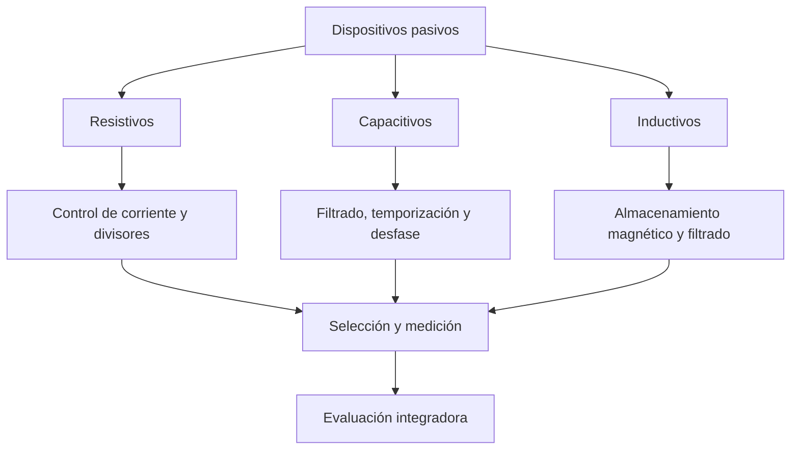

# Título de la Sesión: Evaluación del primer módulo

## Introducción
La cuarta sesión consolida los aprendizajes del módulo sobre dispositivos pasivos y verifica la capacidad del estudiante para relacionar modelos resistivos, capacitivos e inductivos con decisiones de selección, medición y aplicación. La evaluación no solo mide memoria conceptual, sino la competencia para analizar circuitos, justificar supuestos de modelado e interpretar resultados experimentales coherentes con la física de los componentes.

## Objetivo de Aprendizaje
Integrar, analizar y sustentar técnicamente el comportamiento de resistencias, condensadores e inductores mediante resolución de problemas, interpretación de mediciones y argumentación ingenieril rigurosa.

## Desarrollo del Tema (Explicación de la tecnología)
La evaluación del módulo se apoya en tres ejes conceptuales:

1. **Modelo resistivo:** disipación de potencia, divisores de tensión, elementos variables y sensado resistivo.
2. **Modelo capacitivo:** almacenamiento de energía eléctrica, dinámica de carga/descarga, asociación serie-paralelo y respuesta en frecuencia.
3. **Modelo inductivo:** almacenamiento de energía magnética, oposición a cambios de corriente, régimen transitorio RL y reactancia inductiva.

Las expresiones mínimas que el estudiante debe dominar son:

$$
V=IR, \qquad P=VI=I^2R=\frac{V^2}{R}
$$

$$
i_C = C\frac{dv_C}{dt}, \qquad X_C = \frac{1}{\omega C}, \qquad \tau_{RC}=RC
$$

$$
v_L = L\frac{di_L}{dt}, \qquad X_L = \omega L, \qquad \tau_{RL}=\frac{L}{R}
$$

y las energías almacenadas:

$$
W_C = \frac{1}{2}CV^2, \qquad W_L = \frac{1}{2}LI^2
$$

El criterio de evaluación del módulo debe comprobar que el estudiante puede conectar estas ecuaciones con observaciones reales: tolerancia, pérdidas, resistencia serie, no linealidad del LDR, polaridad de condensadores y limitaciones del multímetro.

## Preguntas Orientadoras
1. ¿Qué evidencia experimental permite distinguir entre un componente ideal y uno real en cada familia pasiva?
2. ¿Cómo justificaría un ingeniero la selección entre una solución resistiva, una capacitiva o una inductiva para una misma necesidad funcional?
3. ¿Qué errores de interpretación aparecen al usar solo el multímetro para validar el estado de un capacitor o una bobina?
4. ¿Por qué es necesario vincular ecuaciones temporales y fasoriales al analizar componentes pasivos?
5. ¿Qué parámetros no ideales son más críticos según la aplicación: potencia, ESR, resistencia serie o saturación magnética?

## Ejercicios Propuestos
1. Compare dos divisores de tensión: uno con resistencias fijas y otro con LDR, ambos alimentados con $5\,\text{V}$. Analice cuál presenta mayor sensibilidad frente a cambios de entrada y cuál mayor linealidad.
2. En un circuito RC con $R=4.7\,\text{k}\Omega$ y $C=220\,\mu\text{F}$, determine el tiempo requerido para alcanzar el $90\%$ del voltaje final.
3. Una bobina de $80\,\text{mH}$ presenta resistencia serie de $12\,\Omega$. Explique cómo esta resistencia modifica la respuesta ideal en DC y AC.
4. Diseñe una tabla comparativa entre resistencia, condensador e inductor donde incluya ecuación constitutiva, energía almacenada, oposición principal y variable de estado continua.

## Actividad en Clase (Hands-on)
**Sesión evaluativa de 100 minutos**

1. **20 min:** prueba conceptual individual sobre resistencias, condensadores e inductores.
2. **30 min:** resolución individual de dos problemas de cálculo con unidades y justificación de procedimiento.
3. **30 min:** análisis en parejas de un montaje real o simulado para detectar errores de conexión o selección de componentes.
4. **20 min:** cierre oral breve donde cada equipo defienda una decisión de diseño basada en evidencia eléctrica.

## Recursos Adicionales
- Resumen de ecuaciones fundamentales del módulo elaborado por el docente.
- Alexander, C. K., & Sadiku, M. N. O. *Fundamentals of Electric Circuits*. McGraw-Hill.
- Nilsson, J. W., & Riedel, S. A. *Electric Circuits*. Pearson.
- Hojas de datos sugeridas para repaso: resistencia de película metálica, LDR comercial, capacitor electrolítico radial, inductor de potencia de ferrita.
