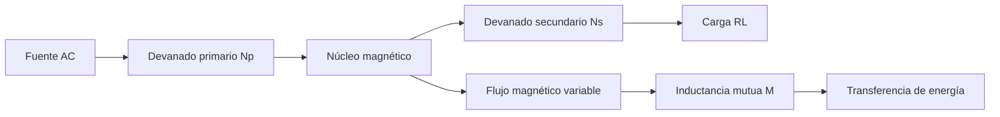

# Título de la Sesión: Inductancia mutua. Transformador eléctrico: partes, funcionamiento. Relación voltaje, corriente y espiras. Tipos de transformadores. Prueba con un multímetro.

## Introducción
El transformador es el elemento central de la conversión electromagnética en sistemas de potencia, instrumentación y fuentes de alimentación. Su operación se basa en la inductancia mutua entre devanados y permite adaptar niveles de tensión y corriente, proporcionar aislamiento galvánico y acoplar energía en corriente alterna con alta eficiencia. Comprender su modelo ideal y real es indispensable para diseñar fuentes reguladas y para interpretar mediciones de laboratorio con seguridad.

## Objetivo de Aprendizaje
Analizar el principio de inductancia mutua y calcular el comportamiento de un transformador monofásico básico, relacionando espiras, tensiones, corrientes y resultados de medición con multímetro.

## Desarrollo del Tema (Explicación de la tecnología)
Cuando una corriente variable circula por un devanado primario, produce un flujo magnético variable $\phi(t)$ en el núcleo. Ese flujo enlaza el devanado secundario e induce una fuerza electromotriz según la ley de Faraday:

$$
e(t) = -N\frac{d\phi(t)}{dt}
$$

Si dos bobinas comparten parte del flujo, aparece la inductancia mutua $M$, definida por:

$$
v_2(t) = M\frac{di_1(t)}{dt}
$$

para una convención de polaridad adecuada. El coeficiente de acoplamiento $k$ relaciona la inductancia mutua con las autoinductancias:

$$
M = k\sqrt{L_1L_2}, \qquad 0 \leq k \leq 1
$$

### Transformador ideal
En un transformador ideal se asume:
- acoplamiento perfecto,
- resistencia nula de devanados,
- flujo totalmente enlazado,
- pérdidas en núcleo nulas,
- permeabilidad muy alta.

Bajo estas condiciones, la relación de transformación es:

$$
\frac{V_p}{V_s} = \frac{N_p}{N_s} = a
$$

La relación de corrientes es inversa:

$$
\frac{I_p}{I_s} = \frac{N_s}{N_p} = \frac{1}{a}
$$

Si no hay pérdidas, la potencia aparente transferida satisface:

$$
V_p I_p \approx V_s I_s
$$

### Modelo real
Un transformador real incluye:
- resistencias de cobre en los devanados,
- reactancias de dispersión,
- pérdidas en el hierro por histéresis y corrientes parásitas,
- corriente de magnetización,
- saturación del núcleo cuando se excede el flujo admisible.

La ecuación RMS para flujo senoidal puede expresarse como:

$$
E = 4.44 f N \Phi_{max}
$$

lo cual muestra que para una frecuencia dada, aumentar el voltaje sin aumentar el número de espiras puede llevar a saturación del núcleo.

### Partes del transformador
- núcleo magnético laminado o ferrita,
- devanado primario,
- devanado secundario,
- aislamiento,
- carcasa o sistema de encapsulado,
- terminales o derivaciones.

### Tipos de transformadores
- elevador y reductor,
- de aislamiento 1:1,
- con derivación central,
- autotransformador,
- de instrumentación (TC y TP),
- de ferrita para alta frecuencia.

### Prueba con multímetro
Con un multímetro pueden verificarse:
- continuidad de devanados,
- resistencia DC relativa del primario y secundario,
- ausencia de cortocircuito entre devanados,
- presencia de derivación central,
- tensión secundaria en vacío si se alimenta de forma segura con una fuente adecuada.

El multímetro no permite, por sí solo, evaluar pérdidas en carga, aislamiento de alta tensión ni comportamiento a frecuencia fuera de diseño.

## Preguntas Orientadoras
1. ¿Por qué un transformador ideal no puede operar con corriente continua en estado estacionario?
2. ¿Cómo se modifica la relación ideal de tensión cuando se consideran caídas de voltaje por resistencia y dispersión?
3. ¿Qué diferencias funcionales existen entre un transformador de 60 Hz y uno de ferrita para conmutación?
4. ¿Qué limitaciones tiene medir solo continuidad para declarar en buen estado un transformador?
5. ¿Cómo influye la frecuencia en el tamaño del núcleo requerido para una misma potencia?

## Ejercicios Propuestos
1. Un transformador ideal tiene $N_p=1200$ espiras y $N_s=240$ espiras. Si el primario se alimenta con $120\,\text{V}_{rms}$, calcule la tensión secundaria en vacío.
2. Un transformador entrega $12\,\text{V}_{rms}$ y $2\,\text{A}_{rms}$ a la carga. Si es ideal y reductor desde $120\,\text{V}_{rms}$, determine la corriente del primario.
3. Calcule el flujo máximo en un devanado de $500$ espiras que desarrolla $24\,\text{V}_{rms}$ a $60\,\text{Hz}$ usando $E=4.44fN\Phi_{max}$.
4. Se mide en un transformador real un secundario de $15\,\text{V}_{rms}$ en vacío y $13.8\,\text{V}_{rms}$ en carga nominal. Determine la regulación porcentual.
5. Un transformador con derivación central entrega $24\,\text{V}_{rms}$ de extremo a extremo. ¿Qué tensión RMS hay entre cada extremo y el punto medio?

## Actividad en Clase (Hands-on)
**Práctica guiada: identificación y caracterización básica de un transformador**

1. Identificar visualmente núcleo, primario, secundario y derivaciones.
2. Medir continuidad y resistencia DC de cada devanado con multímetro.
3. Deducir cuál devanado corresponde al primario a partir del mayor número de espiras y mayor resistencia óhmica aproximada.
4. Alimentar el primario con una fuente AC segura y medir la tensión secundaria en vacío.
5. Verificar experimentalmente la relación de transformación y comparar con la relación estimada de espiras.
6. Analizar el efecto de conectar una carga resistiva y observar la caída de tensión.

## Recursos Adicionales
- Chapman, S. J. *Electric Machinery Fundamentals*. McGraw-Hill.
- Fitzgerald, A. E., Kingsley, C., & Umans, S. D. *Electric Machinery*. McGraw-Hill.
- Hammond Manufacturing. Recursos y catálogos de transformadores: https://www.hammfg.com/electronics/transformers
- Würth Elektronik. Notas técnicas sobre magnetics y transformadores: https://www.we-online.com/
- Hojas de datos sugeridas: transformador encapsulado 120/12 V, transformador con derivación central, ferrita EE para fuentes conmutadas.
