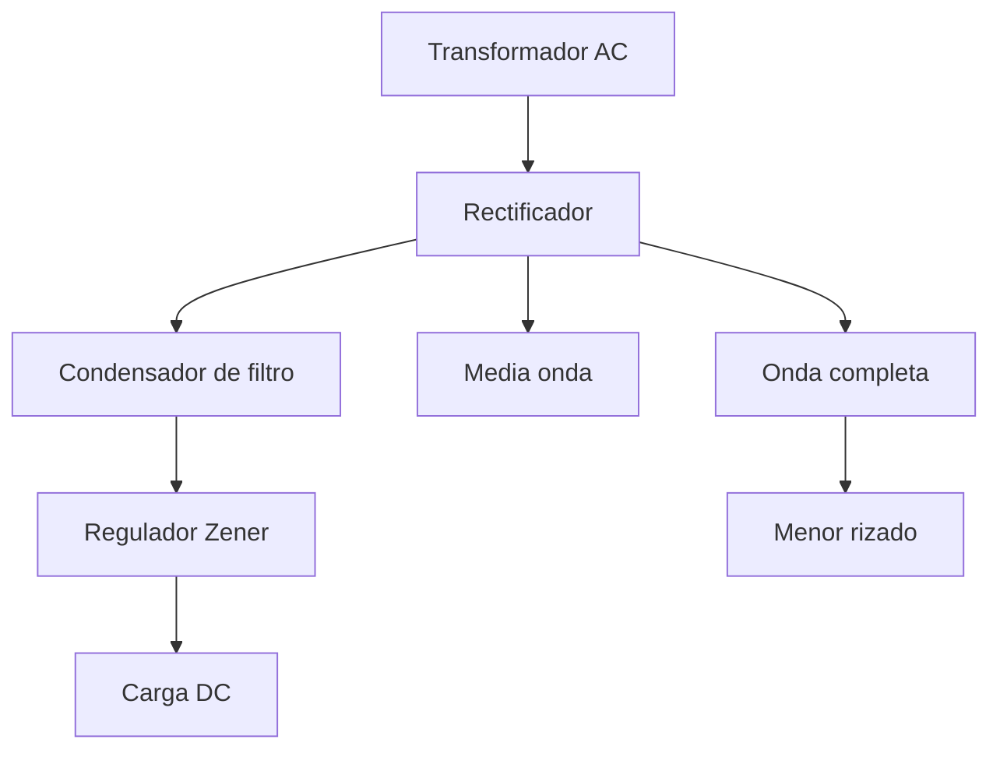

# Título de la Sesión: Diodo rectificador. Rectificación de media onda y onda completa. Prueba del diodo con el multímetro. Diodo Zener, regulador de voltaje. Aplicaciones.

## Introducción
Los diodos son los dispositivos semiconductores más simples y a la vez más decisivos en el diseño de fuentes de alimentación. Permiten convertir una señal alterna en continua pulsante, limitar voltajes, proteger circuitos y establecer referencias de regulación. Esta sesión enlaza la física de la unión PN con los esquemas rectificadores y con el principio de regulación mediante diodo Zener.

## Objetivo de Aprendizaje
Analizar, calcular y verificar circuitos básicos con diodos rectificadores y Zener, interpretando la rectificación, el rizado y la regulación elemental de tensión.

## Desarrollo del Tema (Explicación de la tecnología)
El diodo ideal conduce en polarización directa y bloquea en polarización inversa. En un diodo real de silicio, la conducción directa inicia aproximadamente a partir de una caída de tensión de umbral:

$$
V_D \approx 0.7\,\text{V}
$$

para corrientes moderadas. Su ecuación exponencial aproximada es:

$$
I_D = I_S\left(e^{\frac{V_D}{nV_T}}-1\right)
$$

### Rectificación de media onda
En un rectificador de media onda con carga resistiva, el diodo conduce durante un semiciclo y bloquea durante el otro. Para una entrada senoidal de valor pico $V_m$ y un diodo ideal, el valor promedio de salida es:

$$
V_{DC} = \frac{V_m}{\pi}
$$

Si se considera la caída directa del diodo, la amplitud efectiva disminuye aproximadamente a $V_m - V_D$.

### Rectificación de onda completa
En configuración con derivación central o puente de diodos, ambos semiciclos se aprovechan. Para un rectificador ideal de onda completa con carga resistiva:

$$
V_{DC} = \frac{2V_m}{\pi}
$$

La frecuencia de rizado se duplica respecto de la frecuencia de línea, lo que mejora el filtrado posterior. En un puente rectificador conducen dos diodos por semiciclo, por lo que la caída total aproximada es $2V_D$.

### Filtrado capacitivo
Al conectar un condensador de filtro, la salida se aproxima a la envolvente de los picos. Para una corriente de carga aproximadamente constante:

$$
\Delta V \approx \frac{I_L}{f_r C}
$$

donde $f_r$ es la frecuencia de rizado. En media onda $f_r=f$, y en onda completa $f_r=2f$.

### Diodo Zener como regulador
En polarización inversa, el diodo Zener opera en su región de ruptura controlada y mantiene aproximadamente constante el voltaje:

$$
V_o \approx V_Z
$$

En un regulador Zener simple con resistencia serie $R_s$ y carga $R_L$:

$$
I_s = \frac{V_{in}-V_Z}{R_s}
$$

$$
I_s = I_Z + I_L
$$

Para regulación adecuada debe cumplirse simultáneamente:
- $I_Z \ge I_{Z,min}$,
- $I_Z \le I_{Z,max}$,
- $P_Z = V_Z I_Z \le P_{Z,max}$.

### Prueba del diodo con multímetro
En modo prueba de diodo, el multímetro muestra la caída directa aproximada. Un diodo sano de silicio típicamente exhibe un valor entre $0.55$ y $0.8\,\text{V}$ en directa y circuito abierto en inversa. Si conduce en ambos sentidos, puede estar en cortocircuito; si no conduce en ninguno, puede estar abierto.

## Preguntas Orientadoras
1. ¿Por qué la rectificación de onda completa es preferible a la de media onda en la mayoría de las fuentes DC?
2. ¿Qué compromisos surgen al elegir la resistencia serie de un regulador Zener?
3. ¿Cómo afecta la caída directa de los diodos al voltaje disponible en la carga?
4. ¿Qué limitaciones presenta un regulador Zener simple frente a variaciones grandes de carga o entrada?
5. ¿Por qué la prueba con multímetro no reemplaza la caracterización dinámica del diodo bajo corriente real?

## Ejercicios Propuestos
1. Una fuente senoidal de $12\,\text{V}_{rms}$ alimenta un rectificador de media onda ideal. Calcule el valor pico y el valor promedio DC aproximado.
2. Repita el cálculo anterior para un puente rectificador de onda completa considerando dos caídas de $0.7\,\text{V}$ en conducción.
3. Un rectificador de onda completa con filtro capacitivo entrega $I_L=150\,\text{mA}$ a partir de red de $60\,\text{Hz}$. Calcule el rizado si $C=2200\,\mu\text{F}$.
4. Diseñe un regulador Zener de $5.1\,\text{V}$ alimentado con $12\,\text{V}$ para una carga que consume entre $10\,\text{mA}$ y $40\,\text{mA}$, garantizando al menos $5\,\text{mA}$ por el Zener en peor caso.
5. Para un Zener de $5.1\,\text{V}$ y $P_{max}=0.5\,\text{W}$, determine la corriente máxima segura y explique cómo se usa ese dato en el diseño.

## Actividad en Clase (Hands-on)
**Práctica guiada: rectificador con filtro y regulación Zener**

1. Verificar varios diodos con el multímetro en polarización directa e inversa.
2. Montar un rectificador de media onda y medir el voltaje DC promedio en la carga.
3. Implementar un rectificador de onda completa y comparar amplitud útil y rizado con el caso anterior.
4. Añadir un condensador de filtro y observar la reducción del rizado.
5. Incorporar un diodo Zener con resistencia serie y verificar la regulación ante cambios de carga.
6. Comparar resultados medidos con los cálculos teóricos y discutir fuentes de error.

## Recursos Adicionales
- Boylestad, R. L., & Nashelsky, L. *Electronic Devices and Circuit Theory*. Pearson.
- Sedra, A. S., & Smith, K. C. *Microelectronic Circuits*. Oxford University Press.
- onsemi. Datasheets de diodos rectificadores y Zener: https://www.onsemi.com/
- Vishay. Documentación de puentes rectificadores y Zener: https://www.vishay.com/
- Hojas de datos sugeridas: 1N4007, 1N4148, 1N4733A, puente rectificador de 1 A.
