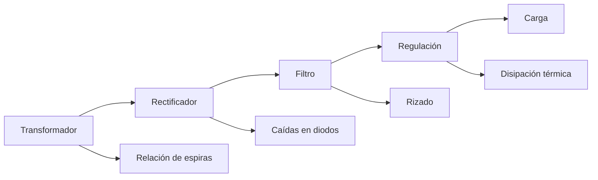

# Título de la Sesión: Evaluación del módulo 2

## Introducción
La sesión de evaluación del segundo módulo comprueba la capacidad del estudiante para integrar el comportamiento electromagnético del transformador con la conducción no lineal de los diodos y con los criterios de diseño de una fuente regulada DC. El énfasis está en la toma de decisiones de ingeniería a partir de ecuaciones, mediciones y restricciones de seguridad eléctrica.

## Objetivo de Aprendizaje
Integrar, calcular y justificar el diseño y análisis de una fuente regulada DC a partir de transformador, rectificación, filtrado y regulación elemental.

## Desarrollo del Tema (Explicación de la tecnología)
La arquitectura conceptual del módulo puede resumirse como una cadena de conversión de energía:

$$
\text{AC de entrada} \rightarrow \text{transformación} \rightarrow \text{rectificación} \rightarrow \text{filtrado} \rightarrow \text{regulación} \rightarrow \text{DC útil}
$$

Las relaciones clave del módulo son:

$$
\frac{V_p}{V_s}=\frac{N_p}{N_s}, \qquad \frac{I_p}{I_s}=\frac{N_s}{N_p}
$$

$$
V_{DC,\text{media onda}} \approx \frac{V_m}{\pi}, \qquad V_{DC,\text{onda completa}} \approx \frac{2V_m}{\pi}
$$

$$
\Delta V \approx \frac{I_L}{f_r C}
$$

$$
P_{reg}=(V_{in}-V_o)I_o
$$

y para una regulación Zener:

$$
I_s=\frac{V_{in}-V_Z}{R_s}, \qquad I_s = I_Z + I_L
$$

El estudiante debe demostrar que comprende no solo estas ecuaciones, sino también las no idealidades asociadas: regulación del transformador, caída directa de diodos, rizado residual, disipación térmica y límites de potencia de los componentes.

## Preguntas Orientadoras
1. ¿Qué etapa condiciona con mayor fuerza la calidad del voltaje de salida en una fuente lineal y por qué?
2. ¿Cuándo sería suficiente un regulador Zener y cuándo conviene migrar a un regulador integrado?
3. ¿Qué errores de diseño pueden surgir si se usa el voltaje RMS del secundario como si fuera directamente voltaje DC disponible?
4. ¿Cómo se manifiesta experimentalmente una fuente subdimensionada en capacitor o en transformador?
5. ¿Qué variables deben revisarse primero cuando la fuente deja de regular bajo carga?

## Ejercicios Propuestos
1. Compare una fuente con rectificación de media onda y otra de onda completa para una misma carga, discutiendo rizado, aprovechamiento del transformador y exigencia del filtro.
2. Una fuente usa un secundario de $9\,\text{V}_{rms}$, puente rectificador y capacitor de $1000\,\mu\text{F}$ para una carga de $200\,\text{mA}$. Estime el rizado y evalúe si podría regularse a $5\,\text{V}$ con un regulador lineal de $2\,\text{V}$ de margen.
3. Se desea regular con Zener a $12\,\text{V}$ una carga que puede variar entre $20\,\text{mA}$ y $80\,\text{mA}$. Proponga el criterio de selección de $R_s$ y discuta el peor caso de disipación.
4. Explique cómo verificaría con multímetro una falla probable en transformador, diodo, capacitor o regulador dentro de una fuente lineal.

## Actividad en Clase (Hands-on)
**Sesión evaluativa de 100 minutos**

1. **20 min:** cuestionario individual sobre transformadores, diodos y regulación.
2. **30 min:** resolución de problemas de diseño y cálculo de fuente DC.
3. **30 min:** diagnóstico guiado de una fuente con una falla simulada o una especificación incompleta.
4. **20 min:** sustentación breve del criterio de diseño o del diagnóstico realizado.

## Recursos Adicionales
- Rashid, M. H. *Power Electronics: Circuits, Devices, and Applications*. Pearson.
- Boylestad, R. L., & Nashelsky, L. *Electronic Devices and Circuit Theory*. Pearson.
- Datasheets de transformador, diodos rectificadores, Zener y reguladores lineales utilizados en laboratorio.
