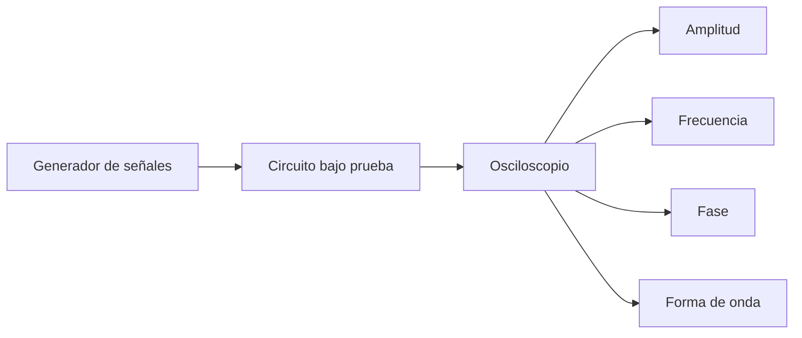

# Título de la Sesión: Manejo de equipo de laboratorio: Generador de señales y Osciloscopio. Medición de amplitud, frecuencia y fase. Aplicaciones del osciloscopio.

## Introducción
El generador de señales y el osciloscopio constituyen el par instrumental básico para excitar, observar y diagnosticar circuitos eléctricos y electrónicos. Mientras el generador permite inyectar formas de onda controladas en amplitud, frecuencia y forma, el osciloscopio hace visible la evolución temporal de la señal y permite medir relaciones dinámicas que un multímetro no puede revelar. Dominar ambos equipos es indispensable para validar diseños, identificar fallas y correlacionar teoría con comportamiento real.

## Objetivo de Aprendizaje
Configurar y utilizar correctamente un generador de señales y un osciloscopio para medir amplitud, frecuencia, período y desfase, interpretando la señal observada en aplicaciones básicas de laboratorio.

## Desarrollo del Tema (Explicación de la tecnología)
Una señal periódica senoidal puede modelarse como:

$$
v(t) = V_p\sin(\omega t + \phi)
$$

donde $V_p$ es el valor pico, $\omega = 2\pi f$ es la frecuencia angular y $\phi$ es la fase inicial. A partir de esta expresión se obtienen magnitudes fundamentales de medición:

$$
T = \frac{1}{f}
$$

$$
V_{pp} = 2V_p
$$

$$
V_{rms} = \frac{V_p}{\sqrt{2}}
$$

para una onda senoidal ideal.

### Generador de señales
El generador de funciones permite producir formas de onda senoidal, cuadrada, triangular y pulsos. Sus parámetros de ajuste más comunes son:
- **Frecuencia:** número de ciclos por segundo.
- **Amplitud:** valor pico, pico a pico o RMS según el equipo.
- **Offset DC:** desplazamiento del nivel medio de la señal.
- **Duty cycle:** relación entre tiempo en alto y período para señales pulsadas.
- **Impedancia de salida:** usualmente $50\,\Omega$, importante para interpretar correctamente la amplitud entregada.

Si el generador está calibrado para una carga de $50\,\Omega$ y se conecta a alta impedancia, la amplitud mostrada puede diferir de la amplitud realmente medida en el circuito.

### Osciloscopio
El osciloscopio representa voltaje versus tiempo y permite observar forma de onda, transitorios, ruido, distorsión y sincronismo entre señales. Sus controles principales son:
- **Escala vertical (V/div):** determina cuántos voltios representa cada división.
- **Base de tiempo (s/div):** determina cuántos segundos representa cada división horizontal.
- **Trigger:** estabiliza la forma de onda en pantalla al fijar una condición de disparo.
- **Acoplamiento AC/DC/GND:** permite bloquear el componente DC, medir la señal completa o referenciar la línea base.
- **Canales:** posibilitan comparar dos señales simultáneamente.

### Medición de amplitud y frecuencia
Si una señal ocupa $N_v$ divisiones verticales y la escala es $k_v$ voltios por división:

$$
V_{pp} = N_v k_v
$$

Si un período ocupa $N_t$ divisiones horizontales y la base de tiempo es $k_t$ segundos por división:

$$
T = N_t k_t, \qquad f = \frac{1}{N_t k_t}
$$

### Medición de fase
Cuando se comparan dos señales de igual frecuencia, el desfase puede calcularse a partir del desplazamiento temporal $\Delta t$ entre puntos equivalentes:

$$
\Delta \phi = 360^\circ \frac{\Delta t}{T}
$$

o en radianes,

$$
\Delta \phi = 2\pi\frac{\Delta t}{T}
$$

Esta medición es clave en circuitos RC, filtros, amplificadores y sistemas de potencia en AC.

### Aplicaciones del osciloscopio
- verificación de señales de entrada y salida,
- medición de tiempos de subida y bajada,
- observación de distorsión o ruido,
- comparación de fase entre dos nodos,
- diagnóstico de fallas intermitentes y transitorios,
- validación de señales de control digital o analógico.

## Preguntas Orientadoras
1. ¿Por qué una misma señal puede mostrar amplitudes distintas según la impedancia de carga y la calibración del generador?
2. ¿Qué errores de interpretación aparecen si el trigger del osciloscopio está mal configurado?
3. ¿Cuándo conviene usar acoplamiento AC en lugar de DC?
4. ¿Qué ventajas ofrece el osciloscopio frente al multímetro en el análisis de señales periódicas?
5. ¿Cómo afecta la base de tiempo a la precisión de la medición de frecuencia y fase?

## Ejercicios Propuestos
1. Una señal senoidal ocupa $4.5$ divisiones verticales en un osciloscopio ajustado a $2\,\text{V/div}$. Calcule $V_{pp}$ y $V_p$.
2. Una forma de onda completa ocupa $3.2$ divisiones horizontales con una base de tiempo de $0.5\,\text{ms/div}$. Determine el período y la frecuencia.
3. Dos señales senoidales de igual frecuencia presentan un desplazamiento temporal de $0.75\,\text{ms}$ y un período de $5\,\text{ms}$. Calcule el desfase en grados.
4. Un generador entrega una onda cuadrada de $1\,\text{kHz}$ con duty cycle del $30\%$. Determine los tiempos en alto y en bajo.
5. Explique cómo verificaría con osciloscopio si una salida tiene ruido de alta frecuencia superpuesto a un nivel DC.

## Actividad en Clase (Hands-on)
**Práctica guiada: configuración instrumental y lectura de señales**

1. Encender y configurar el generador de señales para producir una onda senoidal de amplitud y frecuencia conocidas.
2. Conectar la salida al osciloscopio y ajustar correctamente la escala vertical, horizontal y el trigger.
3. Medir $V_{pp}$, período y frecuencia de la señal senoidal observada.
4. Cambiar a una onda cuadrada y medir duty cycle, tiempos de subida y tiempos de bajada si el equipo lo permite.
5. Visualizar simultáneamente dos señales de igual frecuencia y determinar su desfase.
6. Comparar lectura automática del equipo con medición manual por divisiones.
7. Registrar errores de medición y discutir la influencia de la sonda, el acoplamiento y la impedancia.

## Recursos Adicionales
- Tektronix. *XYZs of Oscilloscopes* y guías introductorias de medición: https://www.tek.com/
- Keysight. Recursos de fundamentos de osciloscopio y generadores de funciones: https://www.keysight.com/
- Horowitz, P., & Hill, W. *The Art of Electronics*. Cambridge University Press.
- Nilsson, J. W., & Riedel, S. A. *Electric Circuits*. Pearson.
- Hojas de datos sugeridas: osciloscopio digital de dos canales, sonda atenuadora 10:1, generador de funciones con salida de $50\,\Omega$.
