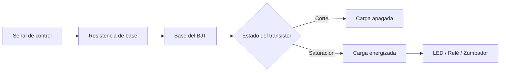

# Título de la Sesión: Transistor bipolar de unión (BJT). Transistor PNP y NPN. El transistor como interruptor. Cálculos para usar el BJT en corte y saturación. Prueba con el multímetro. Aplicaciones.

## Introducción
El transistor bipolar de unión es uno de los dispositivos activos más importantes en electrónica porque permite amplificar señales y controlar cargas con una señal de mando de menor potencia. En aplicaciones de control básico, su operación en corte y saturación lo convierte en un interruptor electrónico eficiente para excitar LEDs, relés, zumbadores y pequeñas cargas DC. Esta sesión se centra en la comprensión física y práctica del BJT NPN y PNP, así como en los cálculos mínimos necesarios para usarlo de forma segura y confiable.

## Objetivo de Aprendizaje
Analizar y dimensionar la operación de un transistor BJT como interruptor en corte y saturación, diferenciando configuraciones NPN y PNP e interpretando sus mediciones básicas con multímetro.

## Desarrollo del Tema (Explicación de la tecnología)
El BJT está formado por dos uniones PN y posee tres terminales: emisor, base y colector. En un transistor NPN, una pequeña corriente de base controla una corriente mayor entre colector y emisor. En región activa ideal:

$$
I_C \approx \beta I_B
$$

donde $\beta$ es la ganancia de corriente DC.

### Tipos NPN y PNP
- **NPN:** conduce cuando la base se hace más positiva que el emisor aproximadamente en $0.7\,\text{V}$.
- **PNP:** conduce cuando la base se hace más negativa que el emisor aproximadamente en $0.7\,\text{V}$.

La unión base-emisor en conducción directa puede aproximarse por:

$$
V_{BE} \approx 0.7\,\text{V}
$$

para un transistor de silicio en corrientes moderadas.

### El BJT como interruptor
En modo interruptor interesan dos estados:

1. **Corte:**
   $$
   I_B \approx 0 \Rightarrow I_C \approx 0
   $$
   El transistor se comporta como interruptor abierto.

2. **Saturación:**
   el transistor conduce fuertemente y la caída colector-emisor es baja:
   $$
   V_{CE(sat)} \approx 0.1 \text{ a } 0.3\,\text{V}
   $$
   El transistor se comporta como interruptor cerrado.

Para garantizar saturación se suele usar una ganancia forzada menor que la nominal:

$$
I_B \geq \frac{I_C}{\beta_{forzada}}
$$

con valores prácticos de $\beta_{forzada}$ entre $5$ y $10$ según la aplicación.

### Cálculo de la resistencia de base
Si una salida de control de voltaje $V_{ctrl}$ excita la base de un NPN a través de una resistencia $R_B$:

$$
R_B = \frac{V_{ctrl}-V_{BE}}{I_B}
$$

Este cálculo debe revisarse verificando que la fuente de control pueda suministrar la corriente de base y que el transistor soporte la corriente del colector.

### Configuración típica con carga resistiva
Para una carga conectada al colector y alimentación $V_{CC}$:

$$
I_C \approx \frac{V_{CC}-V_{CE(sat)}}{R_L}
$$

si la carga es esencialmente resistiva. En cargas inductivas debe añadirse un diodo de rueda libre para proteger el transistor frente a sobretensiones al desconectar.

### Prueba con multímetro
En modo diodo, un BJT puede verificarse como dos uniones PN compartiendo la base:
- en un **NPN**, desde base hacia emisor y desde base hacia colector aparece caída directa en un sentido;
- en un **PNP**, la polaridad se invierte.

La prueba permite identificar terminales y detectar uniones en corto o abiertas, aunque no reemplaza la evaluación dinámica del transistor bajo carga.

## Preguntas Orientadoras
1. ¿Por qué no es correcto diseñar un interruptor BJT usando únicamente la ganancia nominal de hoja de datos?
2. ¿Qué diferencias prácticas existen entre usar un NPN de lado bajo y un PNP de lado alto?
3. ¿Qué riesgo aparece si no se limita la corriente de base?
4. ¿Cómo se manifiesta un transistor que no entra realmente en saturación?
5. ¿Por qué las cargas inductivas requieren protección adicional aunque el BJT esté bien calculado?

## Ejercicios Propuestos
1. Se desea conmutar un LED y su resistencia para una corriente de colector de $20\,\text{mA}$ usando un transistor NPN desde una salida de $5\,\text{V}$. Si se adopta $\beta_{forzada}=10$ y $V_{BE}=0.7\,\text{V}$, calcule $R_B$.
2. Un transistor NPN conmuta una carga resistiva de $120\,\Omega$ conectada a $12\,\text{V}$. Estime la corriente del colector suponiendo $V_{CE(sat)}=0.2\,\text{V}$.
3. Para una carga que requiere $80\,\text{mA}$, determine la corriente mínima de base si se diseña con $\beta_{forzada}=8$.
4. Explique cómo identificaría con un multímetro si un transistor es NPN o PNP.
5. Compare el uso de un BJT como interruptor frente a un relé en términos de aislamiento, velocidad y capacidad de corriente.

## Actividad en Clase (Hands-on)
**Práctica guiada: control de una carga con transistor BJT**

1. Identificar terminales y tipo de varios transistores con ayuda del multímetro.
2. Montar un circuito NPN como interruptor de lado bajo para encender un LED o una pequeña carga DC.
3. Calcular y seleccionar la resistencia de base para asegurar saturación.
4. Medir el voltaje base-emisor y colector-emisor en estado de encendido y apagado.
5. Repetir el montaje con otra condición de corriente de carga y verificar si el transistor sigue saturando.
6. Discutir cómo cambiaría el diseño para un transistor PNP o para una carga inductiva.

## Recursos Adicionales
- Sedra, A. S., & Smith, K. C. *Microelectronic Circuits*. Oxford University Press.
- Boylestad, R. L., & Nashelsky, L. *Electronic Devices and Circuit Theory*. Pearson.
- onsemi. Hojas de datos y notas de aplicación para transistores BJT: https://www.onsemi.com/
- Nexperia. Recursos técnicos de BJT de propósito general: https://www.nexperia.com/
- Hojas de datos sugeridas: 2N2222, BC547, BC557, PN2222A o equivalentes de laboratorio.
