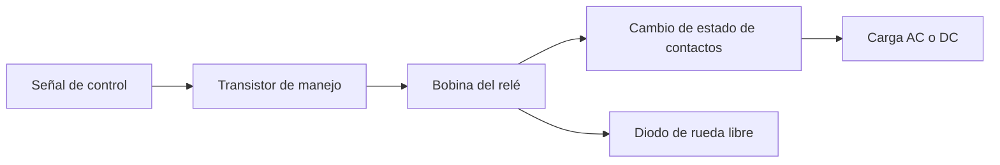

# Título de la Sesión: Interruptores electromecánicos. Relé. Tipos, simbología, funcionamiento, circuitos. Aplicaciones. Comparación con un Transistor.

## Introducción
El relé es un interruptor accionado eléctricamente que permite controlar cargas de mayor tensión o corriente mediante una señal de mando de baja potencia y, además, proporciona aislamiento galvánico entre el circuito de control y el circuito de potencia. Aunque los dispositivos semiconductores han desplazado al relé en muchas aplicaciones de alta velocidad, este sigue siendo fundamental cuando se requiere conmutación de cargas AC, separación eléctrica o múltiples contactos mecánicos.

## Objetivo de Aprendizaje
Interpretar el funcionamiento de un relé electromecánico, seleccionar sus parámetros básicos de uso y compararlo con un transistor para decidir la solución de conmutación más adecuada según la aplicación.

## Desarrollo del Tema (Explicación de la tecnología)
Un relé electromecánico contiene una bobina, un núcleo móvil y uno o varios contactos. Al energizar la bobina, el campo magnético atrae la armadura y cambia el estado de los contactos.

### Bobina del relé
En estado estacionario, la corriente de una bobina de relé alimentada con DC puede aproximarse por:

$$
I_{coil} = \frac{V_{coil}}{R_{coil}}
$$

Durante el transitorio de energización, la corriente crece según el modelo RL:

$$
i(t) = \frac{V}{R}\left(1-e^{-t/\tau}\right)
$$

con

$$
\tau = \frac{L}{R}
$$

lo que explica el retardo de activación respecto de un interruptor puramente resistivo.

### Contactos y simbología
Los contactos se clasifican normalmente como:
- **NO (Normally Open):** normalmente abierto.
- **NC (Normally Closed):** normalmente cerrado.
- **COM:** terminal común.
- **SPST, SPDT, DPDT:** según número de polos y posiciones.

La capacidad de un contacto se especifica en términos de tensión máxima, corriente máxima, tipo de carga y vida útil eléctrica. No es suficiente observar solo la tensión de la bobina.

### Protección frente a la desconexión
Cuando se desenergiza la bobina, la energía almacenada en la inductancia produce una sobretensión. Por ello, en control DC se coloca un diodo de rueda libre en antiparalelo con la bobina para limitar el voltaje inducido:

$$
v_L = L\frac{di}{dt}
$$

Si $di/dt$ es muy grande al abrir el circuito, la tensión inducida también lo será y puede dañar el transistor de manejo o introducir ruido en el sistema.

### Circuitos típicos de accionamiento
Como la bobina suele requerir más corriente que la disponible en una salida lógica, es común usar un transistor BJT o MOSFET como etapa de mando. La cadena de control típica es:

señal lógica $\rightarrow$ transistor conductor $\rightarrow$ bobina del relé $\rightarrow$ conmutación de carga.

### Relé versus transistor
**Ventajas del relé:**
- aislamiento galvánico,
- capacidad de conmutar AC o DC,
- baja resistencia de contacto,
- posibilidad de manejar varias rutas mediante múltiples contactos.

**Ventajas del transistor:**
- alta velocidad,
- ausencia de partes móviles,
- bajo ruido mecánico,
- mayor vida útil en conmutación frecuente,
- integración sencilla con lógica digital.

La elección depende del tipo de carga, frecuencia de conmutación, aislamiento requerido, costo y robustez esperada.

## Preguntas Orientadoras
1. ¿Por qué el relé ofrece aislamiento galvánico y el transistor comúnmente no?
2. ¿Qué parámetros deben revisarse primero al seleccionar un relé para una carga real?
3. ¿Qué consecuencias tiene omitir el diodo de rueda libre en un accionamiento DC?
4. ¿Cuándo resulta preferible un transistor y cuándo un relé?
5. ¿Qué limitaciones impone la naturaleza mecánica de los contactos del relé?

## Ejercicios Propuestos
1. Una bobina de relé de $12\,\text{V}$ posee una resistencia de $240\,\Omega$. Calcule la corriente de excitación en régimen estacionario.
2. Si una bobina tiene $L=120\,\text{mH}$ y $R=240\,\Omega$, determine la constante de tiempo eléctrica.
3. Un relé SPDT debe conmutar una carga de $3\,\text{A}$ a $120\,\text{VAC}$. Explique por qué no bastaría con verificar solo el voltaje nominal de la bobina.
4. Compare la conmutación de una lámpara AC usando relé frente a transistor BJT, indicando cuál solución es viable y por qué.
5. Describa cómo comprobaría con multímetro el estado de la bobina y la continuidad de los contactos NO y NC.

## Actividad en Clase (Hands-on)
**Práctica guiada: accionamiento de un relé y análisis de contactos**

1. Identificar terminales de bobina y contactos en un relé real.
2. Medir resistencia de bobina con multímetro y estimar la corriente nominal.
3. Accionar el relé mediante un transistor y verificar la necesidad del diodo de rueda libre.
4. Medir continuidad de contactos NO y NC antes y después de energizar la bobina.
5. Conmutar una carga de baja potencia y registrar diferencias entre circuito de control y circuito de potencia.
6. Comparar el montaje con un circuito equivalente controlado solo con transistor.

## Recursos Adicionales
- Horowitz, P., & Hill, W. *The Art of Electronics*. Cambridge University Press.
- Omron. Guías y catálogos de relés electromecánicos: https://www.omron.com/
- Finder. Documentación técnica de relés industriales y de interfaz: https://www.findernet.com/
- Songle o fabricante equivalente. Hojas de datos de relés de propósito general usados en laboratorio.
- Notas de aplicación sobre protección de bobinas y supresión de transitorios en cargas inductivas.
