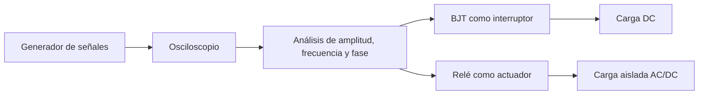

# Título de la Sesión: Evaluación del módulo 3

## Introducción
La sesión de evaluación del tercer módulo verifica la capacidad del estudiante para utilizar instrumentación básica de laboratorio y aplicar dispositivos de control en tareas reales de conmutación y diagnóstico. El foco está en integrar medición de señales, análisis temporal y selección entre transistor y relé según los requisitos eléctricos de una aplicación.

## Objetivo de Aprendizaje
Integrar el uso de generador de señales y osciloscopio con el diseño y análisis de etapas básicas de conmutación con BJT y relé, justificando decisiones técnicas a partir de mediciones y cálculos.

## Desarrollo del Tema (Explicación de la tecnología)
El módulo relaciona tres bloques funcionales:

$$
\text{Generación de señal} \rightarrow \text{medición/observación} \rightarrow \text{accionamiento y control de carga}
$$

Las ecuaciones representativas incluyen:

$$
f = \frac{1}{T}, \qquad \Delta \phi = 360^\circ\frac{\Delta t}{T}
$$

$$
I_B \geq \frac{I_C}{\beta_{forzada}}, \qquad R_B = \frac{V_{ctrl}-V_{BE}}{I_B}
$$

$$
I_{coil} = \frac{V_{coil}}{R_{coil}}, \qquad \tau = \frac{L}{R}
$$

El estudiante debe demostrar dominio de la lectura de señales en el osciloscopio, la interpretación del comportamiento de un BJT en corte y saturación y la selección razonada de un relé cuando se requiere aislamiento o conmutación de otra naturaleza de carga.

## Preguntas Orientadoras
1. ¿Qué información entrega el osciloscopio que resulta crítica para validar una etapa de conmutación?
2. ¿Qué criterio técnico define si una carga debe ser accionada directamente por transistor o mediante relé?
3. ¿Cómo se verifica experimentalmente que un BJT está saturando correctamente?
4. ¿Qué síntomas en la señal medida podrían indicar un problema de trigger, ruido o rebote de contacto?
5. ¿Por qué la medición y la conmutación deben analizarse como un sistema integrado y no como temas aislados?

## Ejercicios Propuestos
1. A partir de una señal cuadrada observada en osciloscopio, determine frecuencia, amplitud y duty cycle, y explique si es adecuada para accionar un transistor como interruptor.
2. Diseñe la resistencia de base para un BJT que energiza una bobina de relé a partir de una salida lógica de $5\,\text{V}$, justificando la saturación.
3. Analice una aplicación donde deba conmutarse una carga AC externa y justifique por qué el uso de relé es más apropiado que un BJT directo.
4. Explique cómo diagnosticaría, con osciloscopio y multímetro, una etapa donde la carga no conmuta pese a existir señal de entrada.

## Actividad en Clase (Hands-on)
**Sesión evaluativa de 100 minutos**

1. **20 min:** cuestionario corto sobre osciloscopio, BJT y relé.
2. **30 min:** medición guiada de una señal y reporte de amplitud, frecuencia y fase o duty cycle.
3. **30 min:** diseño o verificación de una etapa de conmutación con transistor y/o relé.
4. **20 min:** análisis de una falla o justificación de la solución de control seleccionada.

## Recursos Adicionales
- Tektronix y Keysight, manuales introductorios de instrumentación de laboratorio.
- Boylestad, R. L., & Nashelsky, L. *Electronic Devices and Circuit Theory*. Pearson.
- Hojas de datos de un transistor BJT de propósito general y de un relé usado en laboratorio.
