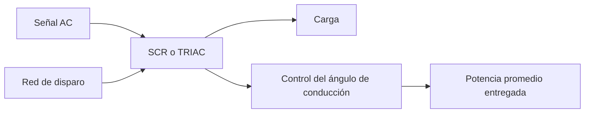

# Título de la Sesión: Tiristor, SCR y TRIAC. Funcionamiento: ángulo de conducción y de disparo. Prueba con el multímetro. Circuitos de aplicación.

## Introducción
Los tiristores son dispositivos semiconductores de potencia diseñados para controlar energía eléctrica en cargas de corriente alterna y, en ciertos casos, corriente continua. El SCR y el TRIAC ocupan un lugar central en aplicaciones de control de fase, regulación de potencia, disparo controlado y automatización básica. Comprender su lógica de disparo, sus condiciones de enclavamiento y sus limitaciones prácticas permite diseñar reguladores de intensidad luminosa, controles de velocidad y sistemas de conmutación robustos.

## Objetivo de Aprendizaje
Analizar el funcionamiento del SCR y del TRIAC, calcular el efecto del ángulo de disparo sobre la conducción y reconocer aplicaciones prácticas de control de potencia en AC y DC.

## Desarrollo del Tema (Explicación de la tecnología)
El tiristor puede entenderse como un dispositivo semiconductor multicapa que pasa del estado de bloqueo al estado de conducción cuando se cumplen simultáneamente condiciones de polarización y disparo. Una vez disparado, el dispositivo permanece conduciendo mientras la corriente de ánodo supere la corriente de mantenimiento.

### SCR
El rectificador controlado de silicio (SCR) posee tres terminales: ánodo, cátodo y compuerta. En polarización directa, el SCR no conduce hasta recibir una corriente de compuerta suficiente o hasta alcanzar ruptura directa no deseada. Cuando entra en conducción, la caída ánodo-cátodo se vuelve relativamente baja.

La potencia instantánea en la carga puede expresarse como:

$$
p(t) = v(t)i(t)
$$

pero en control por ángulo de fase resulta más útil relacionar el disparo con la porción del semiciclo en que el SCR conduce. Si el disparo ocurre a un ángulo $\alpha$ dentro de un semiciclo positivo, el SCR conduce desde $\alpha$ hasta $\pi$ en una carga resistiva ideal.

### TRIAC
El TRIAC es un dispositivo bidireccional equivalente al control de dos SCR en antiparalelo integrado en una sola estructura. Permite controlar ambos semiciclos de una señal AC, por lo que es muy utilizado en regulación de potencia para iluminación, calefacción y motores universales.

### Ángulo de disparo y ángulo de conducción
Si una señal senoidal de entrada se expresa como:

$$
v_s(t) = V_m\sin(\omega t)
$$

entonces el ángulo de disparo $\alpha$ determina el instante en que comienza la conducción dentro de cada semiciclo. Para una carga resistiva con control de fase ideal, el ángulo de conducción es:

$$
\theta_c = \pi - \alpha
$$

por semiciclo en un SCR, y un razonamiento análogo aplica a cada semiciclo en un TRIAC. A mayor $\alpha$, menor tiempo de conducción y menor potencia promedio entregada a la carga.

### Consideraciones prácticas
- el SCR se apaga cuando la corriente cae por debajo de la corriente de mantenimiento,
- en AC, el cruce por cero facilita el apagado natural,
- el TRIAC puede presentar disparos espurios ante altos $dv/dt$,
- las cargas inductivas desplazan la corriente y modifican la extinción,
- es frecuente utilizar DIAC u otras redes de disparo para estabilizar el control.

### Prueba con multímetro
Con un multímetro puede verificarse continuidad anómala entre terminales o una respuesta básica de unión, pero esta prueba es limitada. En la mayoría de los casos, para validar un SCR o TRIAC se requiere un montaje de disparo controlado que permita observar su enclavamiento y extinción.

### Aplicaciones
- reguladores de intensidad luminosa,
- control térmico en resistencias calefactoras,
- arranque y control simple de motores universales,
- rectificación controlada en fuentes DC,
- disparo de actuadores y cargas de potencia media.

## Preguntas Orientadoras
1. ¿Qué diferencia funcional existe entre un diodo rectificador y un SCR en una aplicación de control de potencia?
2. ¿Por qué el TRIAC es especialmente útil en aplicaciones AC de baja y media potencia?
3. ¿Cómo afecta el ángulo de disparo a la tensión efectiva sobre la carga?
4. ¿Qué limitaciones aparecen al controlar una carga inductiva con SCR o TRIAC?
5. ¿Por qué la prueba con multímetro es insuficiente para caracterizar completamente estos dispositivos?

## Ejercicios Propuestos
1. En una señal de $60\,\text{Hz}$, calcule el tiempo correspondiente a un ángulo de disparo de $60^\circ$ dentro de un semiciclo.
2. Para una carga resistiva controlada por SCR con $\alpha=45^\circ$, determine el ángulo de conducción ideal en ese semiciclo.
3. Explique qué ocurre con la potencia promedio sobre una lámpara cuando el ángulo de disparo de un TRIAC aumenta de $30^\circ$ a $120^\circ$.
4. Describa cómo verificaría en laboratorio el encendido y apagado natural de un SCR en un circuito AC básico.
5. Compare el uso de SCR y TRIAC en términos de direccionalidad de conducción y tipo de aplicación recomendada.

## Actividad en Clase (Hands-on)
**Práctica guiada: observación del disparo y control de fase**

1. Identificar terminales y encapsulado de un SCR y un TRIAC de laboratorio.
2. Montar un circuito básico de disparo controlado sobre una carga resistiva de baja potencia.
3. Variar el ángulo de disparo y observar el cambio en la señal de salida sobre la carga.
4. Comparar el comportamiento del SCR en media onda con el del TRIAC en onda completa.
5. Discutir riesgos de seguridad y aislamiento al trabajar con control de potencia en AC.
6. Relacionar forma de onda observada con brillo, calor o respuesta de la carga.

## Recursos Adicionales
- Rashid, M. H. *Power Electronics: Circuits, Devices, and Applications*. Pearson.
- Mohan, N., Undeland, T. M., & Robbins, W. P. *Power Electronics*. Wiley.
- STMicroelectronics. Notas de aplicación y hojas de datos de SCR y TRIAC: https://www.st.com/
- Littelfuse. Recursos técnicos de thyristors y protección asociada: https://www.littelfuse.com/
- Hojas de datos sugeridas: C106, TIC106, BT136, DIAC DB3 o equivalentes de laboratorio.
