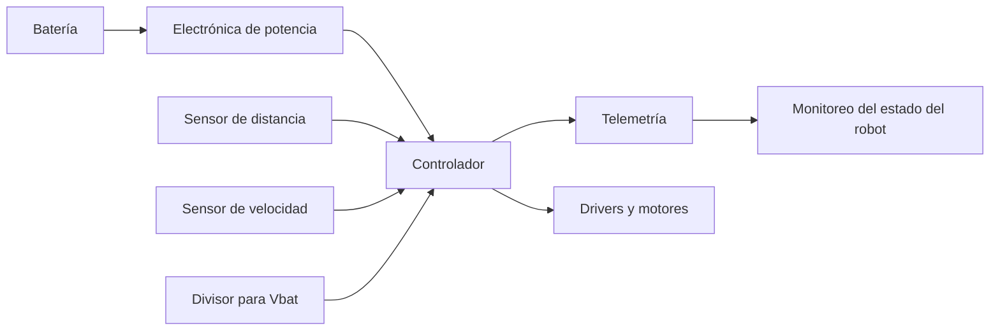

# Título de la Sesión: Robot con telemetría, sensor de distancia a objetos, voltaje de la batería, sensor de velocidad.

## Introducción
La robótica integra sensado, procesamiento, actuación y comunicación para construir sistemas capaces de percibir su entorno y responder de manera autónoma o supervisada. En un robot móvil básico, la telemetría permite observar variables críticas del sistema en tiempo real, como distancia a obstáculos, estado de batería y velocidad, mejorando la seguridad operativa, el diagnóstico y la toma de decisiones de control. Esta sesión conecta fundamentos electrónicos con arquitectura funcional de un robot instrumentado.

## Objetivo de Aprendizaje
Diseñar conceptualmente un robot móvil básico con telemetría, integrando medición de distancia, monitoreo de batería y estimación de velocidad para supervisión y control elemental.

## Desarrollo del Tema (Explicación de la tecnología)
Un robot móvil básico puede descomponerse en subsistemas funcionales:
- alimentación,
- sensado,
- procesamiento,
- accionamiento,
- comunicación o telemetría.

La telemetría consiste en adquirir variables del sistema y transmitirlas hacia una interfaz local o remota. Esto permite monitorear el estado del robot y detectar condiciones anómalas antes de que se conviertan en fallas operativas.

### Sensor de distancia
El sensor de distancia puede basarse en ultrasonido, infrarrojo o tiempo de vuelo. En un modelo simplificado para ultrasonido, la distancia se calcula a partir del tiempo de eco:

$$
d = \frac{v_{sonido} t_{eco}}{2}
$$

donde $v_{sonido}$ es la velocidad del sonido y $t_{eco}$ es el tiempo total de ida y vuelta del pulso.

### Medición del voltaje de batería
El voltaje de batería suele medirse mediante un divisor resistivo conectado a una entrada analógica. Si la batería tiene voltaje $V_{bat}$ y el divisor usa $R_1$ y $R_2$:

$$
V_{med} = V_{bat}\frac{R_2}{R_1 + R_2}
$$

El diseño debe garantizar que $V_{med}$ permanezca dentro del rango admisible del sistema de adquisición. Este monitoreo permite estimar estado de carga, detectar subtensión y proteger la batería frente a descarga excesiva.

### Sensor de velocidad
La velocidad puede estimarse con un encoder, sensor Hall o medición indirecta basada en tiempo entre pulsos. Si una rueda de radio $r$ gira con velocidad angular $\omega$:

$$
v = r\omega
$$

Si un encoder produce $N$ pulsos por vuelta y se cuentan $n$ pulsos en un intervalo $\Delta t$:

$$
\omega = \frac{2\pi}{N}\frac{n}{\Delta t}
$$

por lo que la velocidad lineal puede obtenerse a partir de esta relación.

### Telemetría del sistema
La telemetría puede transmitirse por puerto serial, Bluetooth, Wi-Fi, radiofrecuencia o interfaz cableada. Las variables enviadas típicamente incluyen:
- distancia medida,
- voltaje de batería,
- velocidad estimada,
- estado de actuadores,
- códigos de alarma o diagnóstico.

### Arquitectura funcional
El robot combina entradas de sensores con una lógica de decisión para ajustar motores o emitir alertas. Por ejemplo:
- si la distancia cae por debajo de un umbral, el robot reduce velocidad o se detiene,
- si la batería cae por debajo de un mínimo, el sistema limita potencia o activa alarma,
- si la velocidad real difiere de la esperada, se detecta deslizamiento, carga mecánica elevada o falla de accionamiento.

## Preguntas Orientadoras
1. ¿Qué ventajas aporta la telemetría frente a un robot que solo ejecuta acciones sin reportar su estado?
2. ¿Por qué la medición de batería debe diseñarse con acondicionamiento adecuado antes de entrar al sistema de control?
3. ¿Qué diferencias existen entre medir velocidad con encoder y estimarla solo a partir de voltaje aplicado al motor?
4. ¿Cómo se relacionan seguridad y sensado de distancia en un robot móvil?
5. ¿Qué variables telemétricas serían prioritarias en una aplicación educativa o de prototipo?

## Ejercicios Propuestos
1. Un sensor ultrasónico mide un tiempo de eco de $8\,\text{ms}$. Calcule la distancia al obstáculo usando $v_{sonido}=343\,\text{m/s}$.
2. Diseñe un divisor resistivo para medir una batería de $12\,\text{V}$ con una entrada analógica que admite máximo $5\,\text{V}$, explicando el criterio general de selección.
3. Un encoder de $20$ pulsos por vuelta registra $50$ pulsos en $0.5\,\text{s}$. Calcule la velocidad angular.
4. Si una rueda tiene radio de $4\,\text{cm}$ y gira a $10\,\text{rad/s}$, determine la velocidad lineal del robot.
5. Proponga tres alarmas telemétricas que ayuden a proteger el robot durante su operación.

## Actividad en Clase (Hands-on)
**Práctica guiada: arquitectura de robot móvil con sensado y telemetría**

1. Identificar los bloques funcionales mínimos del robot y su interconexión.
2. Simular o plantear la lectura de un sensor de distancia y definir un umbral de parada.
3. Diseñar conceptualmente el monitoreo del voltaje de batería mediante divisor resistivo.
4. Analizar cómo se obtendría la velocidad usando pulsos de encoder o sensor Hall.
5. Definir el formato de telemetría a transmitir: variables, unidades y frecuencia de actualización.
6. Proponer la lógica básica de decisión ante obstáculo cercano, batería baja o pérdida de velocidad.

## Recursos Adicionales
- Siegwart, R., Nourbakhsh, I. R., & Scaramuzza, D. *Introduction to Autonomous Mobile Robots*. MIT Press.
- Craig, J. J. *Introduction to Robotics*. Pearson.
- Pololu y SparkFun. Recursos introductorios sobre encoders, sensores de distancia y controladores de motores.
- Datasheets sugeridos: HC-SR04 o sensor equivalente, encoder incremental básico, sensor Hall de velocidad, módulo de telemetría serial/Bluetooth.
- Documentación de referencia de plataformas educativas de robótica móvil con monitoreo de batería y sensores.
