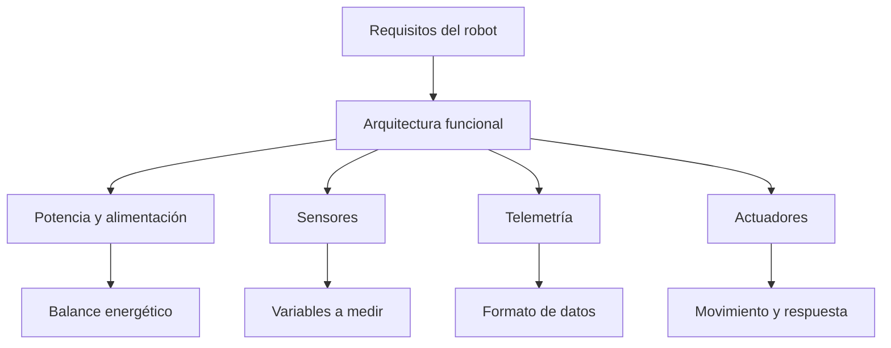

# Título de la Sesión: Trabajo práctico: diseño e integración inicial del robot con telemetría.

## Introducción
El trabajo práctico del módulo traslada los conceptos estudiados a una solución integradora donde electrónica de potencia, sensado y robótica convergen en un sistema funcional. La primera etapa del proyecto se enfoca en traducir requisitos en arquitectura, seleccionar subsistemas y planificar la integración del robot con énfasis en medición, seguridad eléctrica y coherencia técnica del diseño.

## Objetivo de Aprendizaje
Estructurar el diseño inicial de un robot móvil con telemetría, definiendo bloques funcionales, variables a medir, criterios de selección de componentes y estrategia básica de integración.

## Desarrollo del Tema (Explicación de la tecnología)
El diseño de un robot no consiste solo en unir componentes, sino en garantizar compatibilidad entre potencia, señales, sensores y objetivos de operación. En una fase inicial deben quedar definidos:
- propósito del robot,
- variables a medir,
- actuadores y cargas,
- requerimientos de alimentación,
- estrategia de comunicación de telemetría,
- márgenes de seguridad y protección.

### Definición de requisitos
Los requisitos funcionales pueden incluir:
- evitar obstáculos,
- reportar estado de batería,
- estimar velocidad de desplazamiento,
- ejecutar movimiento básico hacia adelante, atrás y parada,
- operar dentro de un tiempo mínimo con la fuente de energía disponible.

### Balance preliminar de potencia
Si el robot consume una corriente total aproximada $I_{tot}$ desde una batería de voltaje $V_{bat}$, la potencia eléctrica requerida es:

$$
P_{tot} = V_{bat} I_{tot}
$$

Si la batería tiene una capacidad nominal $C_{bat}$ en amperio-hora, el tiempo ideal de operación puede estimarse como:

$$
t_{op} \approx \frac{C_{bat}}{I_{tot}}
$$

como primera aproximación, sin considerar pérdidas, variación de carga ni restricciones de descarga útil.

### Integración de señales y potencia
La etapa de diseño debe separar claramente:
- rutas de potencia para motores y actuadores,
- rutas de señal para sensores,
- referencia de tierra común cuando sea necesaria,
- protección frente a ruido, caídas de tensión y corrientes transitorias.

### Plan de validación
También es recomendable definir desde esta fase cómo se validará cada bloque:
- medición del divisor de batería,
- verificación de respuesta del sensor de distancia,
- conteo correcto de pulsos de velocidad,
- transmisión consistente de telemetría,
- respuesta del robot frente a eventos críticos.

## Preguntas Orientadoras
1. ¿Qué decisiones de diseño deben tomarse antes de comenzar el montaje físico del robot?
2. ¿Por qué es importante separar conceptualmente potencia y señal desde la fase inicial?
3. ¿Qué riesgos aparecen si no se estiman corriente total y autonomía esperada?
4. ¿Cómo influye la definición de variables telemétricas en la arquitectura del sistema?
5. ¿Qué criterio permite priorizar funcionalidades cuando el proyecto tiene restricciones de tiempo o recursos?

## Ejercicios Propuestos
1. Estime la potencia total de un robot alimentado a $12\,\text{V}$ que consume $1.8\,\text{A}$ en operación nominal.
2. Si la batería es de $12\,\text{V}$ y $4\,\text{Ah}$, calcule el tiempo ideal de operación para una corriente promedio de $1.2\,\text{A}$.
3. Enumere los subsistemas mínimos necesarios para construir un robot móvil con telemetría básica y justifique su función.
4. Proponga una tabla de variables telemétricas con nombre, unidad y rango esperado.
5. Describa un criterio razonable para validar primero los bloques del robot antes de hacer la integración total.

## Actividad en Clase (Hands-on)
**Práctica guiada: planeación y arquitectura del proyecto robótico**

1. Definir el objetivo funcional del robot y sus restricciones principales.
2. Dibujar el diagrama de bloques del sistema completo.
3. Estimar consumo eléctrico y autonomía preliminar.
4. Seleccionar variables telemétricas prioritarias y sus rangos de medición.
5. Identificar puntos de prueba para validar cada bloque antes de la integración final.
6. Presentar una propuesta corta de arquitectura y recibir retroalimentación técnica.

## Recursos Adicionales
- Norton, H. N. *Design of Machinery* y recursos introductorios de integración mecatrónica.
- Manuales de plataformas educativas de robótica móvil y prototipado electrónico.
- Notas de aplicación sobre distribución de potencia, protección de motores DC y medición de batería en sistemas embebidos.
- Ejemplos de diagramas de bloques para robots móviles educativos.
